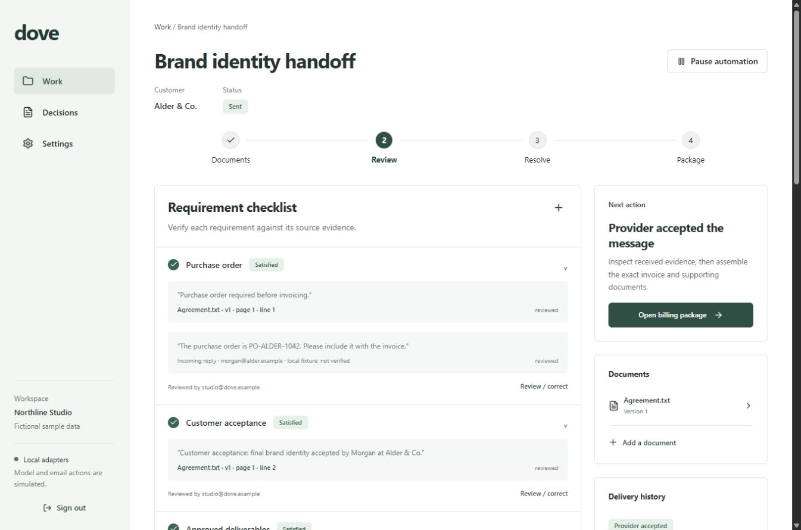

# Dove

From completed work to completed paperwork.

**[Open Dove](https://dove-paperwork.alx21.chatgpt.site/workspace)** · **[Visit the website](https://dove-paperwork.alx21.chatgpt.site)** · **[Request early access](https://dove-paperwork.alx21.chatgpt.site/#access)**

Dove helps service businesses gather missing purchase orders, review acceptance evidence and assemble an approved billing package after the work is finished. Every outgoing request and package requires the appropriate human authorization.



## What is available

| Part | Status |
| :--- | :--- |
| Public website | Live on OpenAI Sites, with a working early access form |
| Application in this repository | Runnable locally with fictional samples and simulated model and email adapters |
| Hosted customer workspace | Live on ChatGPT Sites by invitation, with OpenAI analysis, private documents and package review/download |

The hosted website and workspace source is in [sites/](sites/README.md). Its access request form records interest and does not create an account. Start with the [hosted workspace guide](docs/HOSTED-WORKSPACE.md) to use the online app. Outgoing email is unconfigured; automatic incoming email and scheduled reminders are not implemented in the Sites version. The Python sample below remains a separate application.

## Run the local Python sample

Install Git and Docker with the Linux engine and a current Docker Compose plugin. Docker supplies Python, Node and the application dependencies.

```sh
git clone https://github.com/agammann/dove.git
cd dove
docker compose up --build --detach --wait --wait-timeout 180
docker compose exec api python -m dove.cli seed
```

Run the seed command only after startup succeeds. Open `http://127.0.0.1:8000`, choose **Design studio**, and sign in with the fictional sample password `Dove-local-sample-2026!`. No API key or real email is required.

If port 8000 is occupied, configure an alternate port **before startup** using the [first run guide](docs/QUICKSTART.md#choose-a-local-address). That guide covers prerequisites, sample accounts, expected health output, the walkthrough, stopping the app and troubleshooting.

## The workflow

1. **Gather:** Upload readable PDF or TXT documents for a completed job.
2. **Review:** Inspect proposed requirements beside source excerpts and resolve conflicting evidence.
3. **Resolve:** Review and authorize a missing item request, then review the reply and supporting documents.
4. **Package:** Check invoice lines, recipients and attachments. Approve the exact package, then separately authorize delivery.

Provider acceptance, confirmed email delivery, customer acceptance and payment are distinct states. The local sample stops at simulated provider acceptance.

## Documentation

| I want to… | Guide |
| :--- | :--- |
| Use the hosted workspace | [Hosted Dove](docs/HOSTED-WORKSPACE.md) |
| Run the sample and troubleshoot setup | [First run](docs/QUICKSTART.md) |
| Change code or run checks | [Development](docs/DEVELOPMENT.md) |
| Review access requests and issue invitations | [Operations](docs/OPERATIONS.md) |
| Prepare a production host and backups | [Deployment](docs/DEPLOYMENT.md) |
| Understand implementation and data handling | [Documentation index](docs/README.md) |
| Review evidence and unfinished release work | [Validation](docs/VALIDATION.md), [release checklist](docs/RELEASE-CHECKLIST.md), [progress](PROGRESS.md) |

## Repository layout

| Path | Contents |
| :--- | :--- |
| `sites/` | Published Sites website and invitation workspace, migrations and verification tools |
| `backend/` | FastAPI application, worker, migrations, locked Python dependencies and tests |
| `frontend/` | React interface, Vite configuration and pnpm lockfile |
| `deploy/` | Production reverse proxy configuration |
| `scripts/` | Backup, isolated restore verification and dependency notice collection |
| `docs/` | Setup, development, operations, architecture and release guidance |
| `THIRD-PARTY-NOTICES/` | Dependency licenses and notices |

## Scope and source terms

This preview supports human reviewed document requirements and billing packages. OCR, mailbox synchronization, accounting integrations, tax decisions, payment collection and granular organization roles are outside this release.

The repository is public. No open source license has been selected for Dove's original source. Dependency licenses remain applicable; their [notices](THIRD-PARTY-NOTICES/README.md) are retained.
