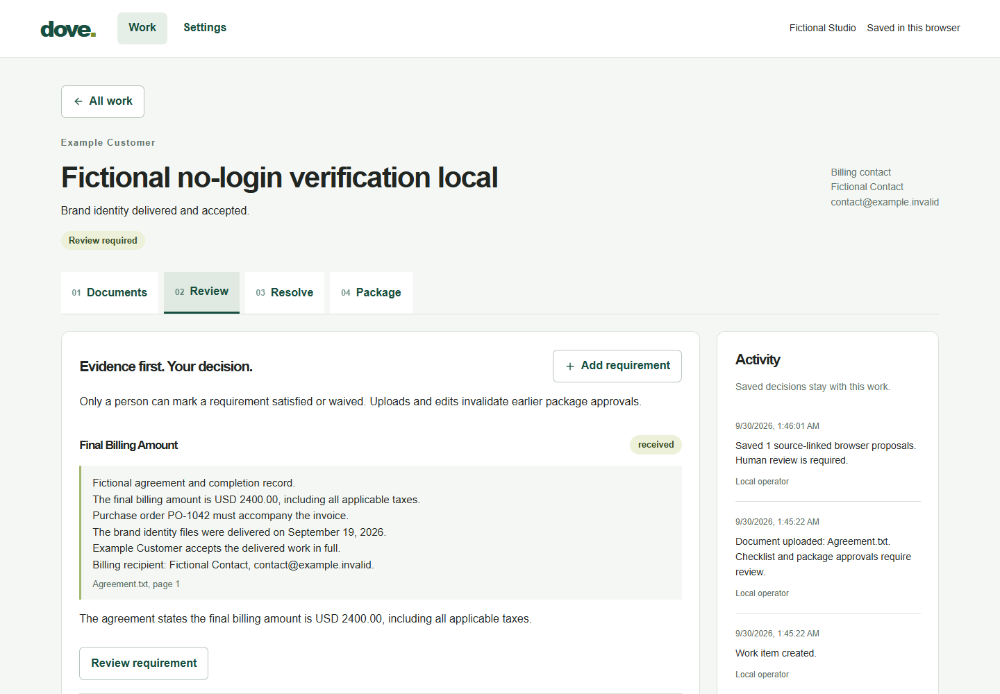

# Dove

From completed work to completed paperwork.

**[Open Dove](https://dove-paperwork.alx21.chatgpt.site/workspace)** · **[Visit the website](https://dove-paperwork.alx21.chatgpt.site)** · **[Browser workspace guide](docs/HOSTED-WORKSPACE.md)**

Dove helps service businesses gather missing purchase orders, review acceptance evidence and assemble an approved billing package after the work is finished. The browser workspace needs no login or ChatGPT account. Documents and work are saved on the visitor’s device. Device analysis and manual review require no API key; optional hosted analysis uses the visitor’s own OpenAI key and API billing.



## What is available

| Part | Status |
| :--- | :--- |
| Public website | Live, with direct access to the browser workspace |
| Application in this repository | Runnable locally with fictional samples and simulated model and email adapters |
| Browser workspace | No login; local documents, device or visitor-funded hosted analysis, evidence review, PDF/ZIP packages and complete backup export/import |

The published website source is in [sites/](sites/README.md). Open it and start: no account or invitation is required. Files, extracted text and decisions stay in IndexedDB in that browser profile. Device analysis downloads public model assets on first use and requires WebGPU and enough graphics memory. Hosted analysis sends the complete document text, filenames and work context through this server to OpenAI in one paid request using your key, with GPT-5.4 selected by default. It accepts up to 32,000 extracted characters and proposes up to 20 requirements with one or two source quotes each. Quotes preserve source words while normalizing whitespace. Oversized work is not partially sent; use device analysis or manual review. Keys stay in tab memory and are excluded from saved workspace data and backups. Manual review and packaging work without loading or calling a model.

**Back up your work in Settings.** Export includes original files and packages; restore replaces the local workspace and requires renewed package approval. Clearing browser data can erase saved work. There is no automatic sync, teammate access or email delivery. Backup ZIPs and local records are not encrypted by Dove. See the [browser workspace guide](docs/HOSTED-WORKSPACE.md).

The Python sample below remains a separate implementation with its own accounts and optional providers. Existing hosted records were not deleted or made public by the browser migration.

## Run the local Python sample

Install Git and Docker with the Linux engine and a current Docker Compose plugin. Docker supplies Python, Node and the application dependencies.

```sh
git clone https://github.com/agammann/dove.git
cd dove
docker compose up --build --detach --wait --wait-timeout 180
docker compose exec api python -m dove.cli seed
```

Run the seed command only after startup succeeds. Open `http://127.0.0.1:8000`, choose **Design studio**, and sign in with the fictional sample password `Dove-local-sample-2026!`. No API key or real email is required.

If port 8000 is occupied, configure an alternate port **before startup** using the [first run guide](docs/QUICKSTART.md#choose-a-local-address). That guide covers prerequisites, sample accounts, expected health output, the walkthrough, stopping the app and troubleshooting.

## Separate Python sample workflow

1. **Gather:** Upload readable PDF or TXT documents for a completed job.
2. **Review:** Inspect proposed requirements beside source excerpts and resolve conflicting evidence.
3. **Resolve:** Review and authorize a missing item request, then review the reply and supporting documents.
4. **Package:** Check invoice lines, recipients and attachments. Approve the exact package, then separately authorize delivery.

Provider acceptance, confirmed email delivery, customer acceptance and payment are distinct states. The local sample stops at simulated provider acceptance.

## Documentation

| I want to… | Guide |
| :--- | :--- |
| Use the hosted workspace | [Hosted Dove](docs/HOSTED-WORKSPACE.md) |
| Run the sample and troubleshoot setup | [First run](docs/QUICKSTART.md) |
| Change code or run checks | [Development](docs/DEVELOPMENT.md) |
| Operate the separate Python application | [Operations](docs/OPERATIONS.md) |
| Prepare a production host and backups | [Deployment](docs/DEPLOYMENT.md) |
| Understand implementation and data handling | [Documentation index](docs/README.md) |
| Review evidence and unfinished release work | [Validation](docs/VALIDATION.md), [release checklist](docs/RELEASE-CHECKLIST.md), [progress](PROGRESS.md) |

## Repository layout

| Path | Contents |
| :--- | :--- |
| `sites/` | Published browser workspace, backup tools, retained legacy migrations and verification |
| `backend/` | FastAPI application, worker, migrations, locked Python dependencies and tests |
| `frontend/` | React interface, Vite configuration and pnpm lockfile |
| `deploy/` | Production reverse proxy configuration |
| `scripts/` | Backup, isolated restore verification and dependency notice collection |
| `docs/` | Setup, development, operations, architecture and release guidance |
| `THIRD-PARTY-NOTICES/` | Dependency licenses and notices |

## Scope and source terms

This preview supports human reviewed document requirements and billing packages. OCR, mailbox synchronization, accounting integrations, tax decisions, payment collection and granular organization roles are outside this release.

The repository is public. No open source license has been selected for Dove's original source. Dependency licenses remain applicable; their [notices](THIRD-PARTY-NOTICES/README.md) are retained.
